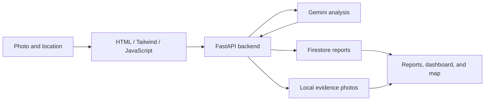

# Civic Sentinel

**Your City. Your Voice. Our Intelligence.**

Civic Sentinel is a working hackathon prototype that turns a photograph of a civic issue into a structured, trackable report. Built around Chandigarh's sectors, it combines Gemini image analysis with saved evidence, an incident map, duplicate hints, and progress tracking.

## Features

| Feature | What it does |
| --- | --- |
| Photo reporting | Upload a JPG, PNG, or WebP image and add a sector or GPS location. |
| Gemini analysis | Return the problem, category, visible evidence, suggested action, and estimated priority. |
| Saved incidents | Store structured reports in Firebase Firestore. |
| Evidence photos | Preserve a normalized JPEG in local backend storage. |
| Incident map | Explore GPS reports using Leaflet and OpenStreetMap. |
| Duplicate hints | Flag similar recent active reports for human review while keeping both reports. |
| Status tracking | Move reports through Open, In Progress, and Resolved. |
| City Overview | Show report counts by status, category, and priority. |
| Google sign-in | Verify Firebase tokens and restrict edits to the creator or an administrator. |

Supported categories include roads, waste, traffic, streetlights, drainage, pedestrian issues, cycling, and other issues. Priority is an AI estimate based on visible evidence, intended to support human review.

## How it works

1. Upload an issue photograph.
2. Select a Chandigarh sector or use GPS, and add optional context.
3. Select **Analyze with AI** and review the five analysis fields.
4. View the saved incident and its evidence photo.
5. Explore GPS reports on the map and review possible duplicate hints.
6. Update the report's status and check the dashboard.



## Technology

- **Frontend:** HTML, Tailwind CSS, JavaScript, Firebase Auth SDK, Leaflet, OpenStreetMap.
- **Backend:** Python, FastAPI, Pydantic, Google Gen AI SDK, Firebase Admin SDK, Pillow.
- **Storage:** Firestore for reports; local backend storage for evidence images.

The frontend has no Node build step. The backend currently requests `gemini-3.5-flash-lite`; your Gemini key must have access to that model. Internet access is required for Gemini, Firebase, map tiles, and frontend CDN assets.

## Run locally

### 1. Configure services

You need Python 3.10 or newer, a Gemini API key, and your own Firebase project with a Firestore database.

1. Create a Firebase project and a Firestore database in production mode.
2. Obtain a service-account credential for that project and keep it outside this repository.
3. Copy `backend/.env.example` to `backend/.env`.
4. Fill in `GEMINI_API_KEY`, `FIREBASE_PROJECT_ID`, and `GOOGLE_APPLICATION_CREDENTIALS`. Use an absolute credential path with forward slashes on Windows.

See [FIREBASE_SETUP.md](FIREBASE_SETUP.md) to configure Google sign-in. Working credentials, saved reports, and uploaded evidence are not included in the repository.

### 2. Choose authentication mode

The example configuration defaults to Firebase authentication. Enable Google sign-in and supply the Firebase web values in `.env` for this mode.

For a local presentation without a sign-in screen, set:

```dotenv
CIVIC_AUTH_MODE=local_demo
CIVIC_LOCAL_MODE_SWITCH=0
```

This still needs Gemini and Firestore credentials. Demo mode accepts only loopback requests. Keep both servers bound to `127.0.0.1`; use Firebase mode for any shared deployment.

### 3. Start the backend

From the repository root in PowerShell:

```powershell
python -m venv backend/.venv
./backend/.venv/Scripts/python.exe -m pip install -r backend/requirements.txt
./backend/.venv/Scripts/python.exe -m uvicorn main:app --app-dir backend --host 127.0.0.1 --port 8000
```

On macOS or Linux:

```sh
python3 -m venv backend/.venv
backend/.venv/bin/python -m pip install -r backend/requirements.txt
backend/.venv/bin/python -m uvicorn main:app --app-dir backend --host 127.0.0.1 --port 8000
```

### 4. Start the frontend

In a second terminal at the repository root:

```sh
python -m http.server 5500 --bind 127.0.0.1 --directory frontend
```

Use `python3` if that is your system's Python command. Open **http://localhost:5500/**. API documentation is at **http://127.0.0.1:8000/docs**. Use Ctrl+C in each terminal to stop the servers.

## Project structure

```text
civic-sentinel/
├── frontend/
│   ├── index.html
│   ├── script.js
│   ├── auth.js
│   └── style.css
├── backend/
│   ├── main.py
│   ├── security.py
│   ├── photos.py
│   ├── duplicates.py
│   ├── dashboard.py
│   ├── report_visibility.py
│   ├── switch_auth.py
│   ├── test_gemini.py
│   ├── test_image.py
│   ├── requirements.txt
│   └── .env.example
├── Enable Authentication.cmd
├── Enable Demo Mode.cmd
├── FIREBASE_SETUP.md
└── README.md
```

The two `test_*.py` files are optional live Gemini checks, not an automated test suite. They make real API requests. To use the image check, provide your own ignored `backend/test_photo.jpg` and run it from `backend` after configuration.

The Windows mode-switch shortcuts are optional and require `CIVIC_LOCAL_MODE_SWITCH=1` in `.env`; see the setup guide.

## Current limits and next steps

- AI assessments and duplicate hints need human review. Updating a status does not independently verify a repair. The prototype does not automatically send reports to a municipality.
- GPS reports appear on the map. Sector-only reports remain in the list until exact coordinates are available.
- Duplicate checks compare category and wording with the latest 250 reports from the last 30 days. Matches must be active and within 100 metres by GPS, or in the same sector when neither report has GPS.
- The frontend list and map show the latest 50 visible reports. Dashboard totals cover all visible reports and currently scan the collection.
- Photos are limited to 10 MB and 25 million pixels, resized to at most 2048 pixels per side, and saved as JPEG without EXIF/GPS metadata. They are previews, not untouched originals.
- Online deployment still needs HTTPS, persistent photo storage, Firebase mode, correct allowed origins, and managed secrets.

The next milestone is a hosted deployment with permanent photo storage and more scalable database queries.

## Kept out of GitHub

The `.gitignore` excludes real environment files, service-account credentials, private keys, virtual environments, uploaded photos, local authentication state, logs, and database backups. Only the placeholder `.env.example` is included.

The running local project, its Firebase database, and evidence files are separate from this source repository.
